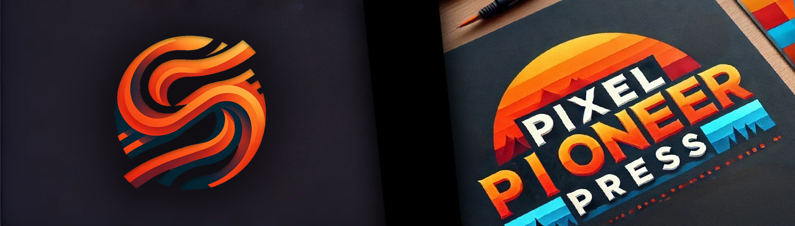

# Pixel Pioneer Press

**Pixel Pioneer Press** is a centralized hub for gamers that allows users to synchronize all gaming platforms into one unified interface. It offers daily game recommendations, cross-platform game organization, and social networking features. With support for indie games, Pixel Pioneer Press ensures all titles are ranked and discoverable.

## Vision

**Pixel Pioneer Press** aims to become the ultimate gaming hub, empowering gamers to organize, discover, and connect like never before. By synchronizing games from multiple platforms into one centralized interface, the platform eliminates the need to juggle between different gaming services. 

This vision extends beyond just utility—it aspires to foster a thriving social community for gamers. With support for indie games, personalized recommendations, and real-time social features, Pixel Pioneer Press ensures that every gamer can discover new titles, share experiences, and connect with friends in meaningful ways. Whether you're a casual player or a hardcore enthusiast, Pixel Pioneer Press makes gaming more accessible, enjoyable, and collaborative.

## 🌟 Features

### 🎮 User-Centric Features:
- **Daily Game Recommendations**: Receive four personalized game suggestions every day.
- **Top Games Access**: Explore the top 100 most popular games on Steam.
- **User Accounts**: Create and manage accounts with secure Firebase authentication.
- **Wishlists**: Build and manage a personalized game wishlist.
- **Friend Management**: Add and manage friends within the platform.
- **Real-Time Messaging**: Chat instantly with friends using Firebase's real-time database.

### 🔗 Platform Integration:
- Synchronize games across platforms, including indie games.
- Classify and organize games from different platforms into a unified view.

### 🌐 Social Networking:
- Share games and recommendations with friends.
- Explore and interact with your friends' wishlists.

---

## 🚀 Live Demo

Visit the live application: [Pixel Pioneer Press](https://pixelpioneerpress.guillaumeschneider.fr)

---

## 🛠️ Technology Stack

### Frontend:
- **Angular**: Provides a modern, responsive, and interactive user interface.
- **Bootstrap**: Ensures a mobile-friendly, consistent design.

### Backend:
- **Python**: Handles data modeling and platform synchronization.
- **Firebase**: Powers authentication, real-time messaging, and friend management.

---

## 🐛 Known Issues

- Performance: Initial game recommendations may load slowly due to platform synchronization.
- Platform Support: Currently optimized for Steam; additional platform support is planned.

## 📄 License

This project is licensed under the MIT License. See the LICENSE file for details.

## 📧 Contact

For inquiries or feedback, feel free to reach out:

- Author: Guillaume Schneider
- Email: contact@guillaumeschneider.fr

---
